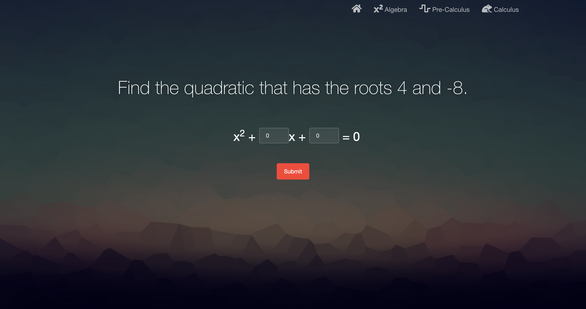
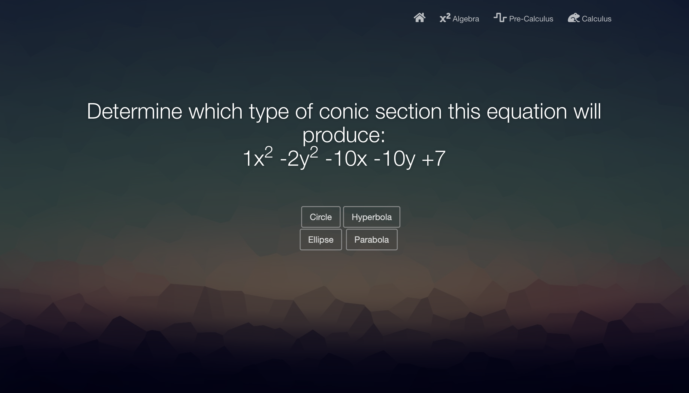
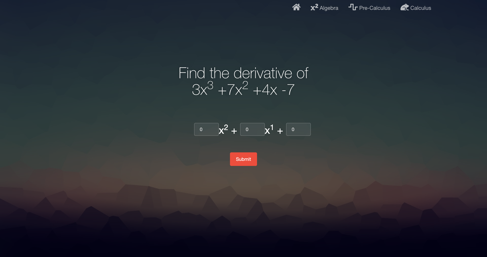
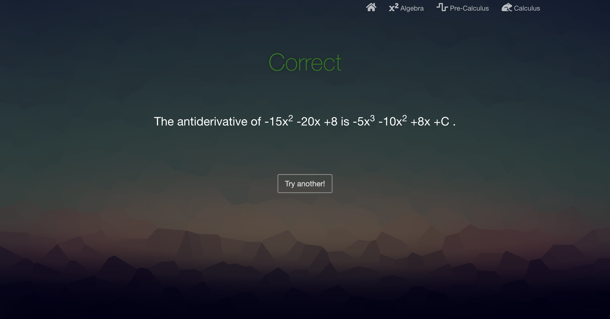

# Tau
Maryann Foley and Crystal Wang

Our project generates random, but not too difficult problems for 3 math topics: Algebra, precalc, and calculus.  Algebra problems consist of expansion and factoring, precalc questions consist of conic sections, and calculus questions consist of finding derivatives and integrals. The user can input their answers and will get told if they were correct and will be told the correct answer. 

### Example pages
#### Algebra Question 

#### Pre-Calc Question

#### Calc Question

#### Sample Response

### Instructions for setup:

#### Virtual enviornment:
- It is important to use a venv because it creates an isolated python enviornment to run code.  It allows you to
have your dependencies installed exclusively on it, not globally. (you don't need root access!)  This is especially useful if you need to use 2 different versions of a package with 2 pieces of code.

Steps to create a venv:
1. In a terminal, go to the folder in which you want to keep your venv
2. Run `python3 -m venv EXVENV`
   1. We are using EXVENV as the name of the virtual enviornment; you can use any name you would like
3. Activate your virtual enviornment by running `source EXVENV/bin/activate`
   1. Your computer's name will now be preceded by (EXVENV).  You are now inside of the virtual enviornment.
4. Install dependencies (see below)
5. To exit the venv, run `deactivate`
6. You can now activate your virtual enviornment from any cwd by running `source ~/ROUTE/TO/ENV/EXVENV/bin/activate`

#### Dependencies!

- flask

The back end framework that allows you to host the website
- wheel

## Launch instructions:
1. Activate your virtual enviornment
2. Clone and cd into this repo
3. Run `python3 app.py`
    - Note: run app.py in this directory because our files utilize relative paths.
4. Enjoy!
